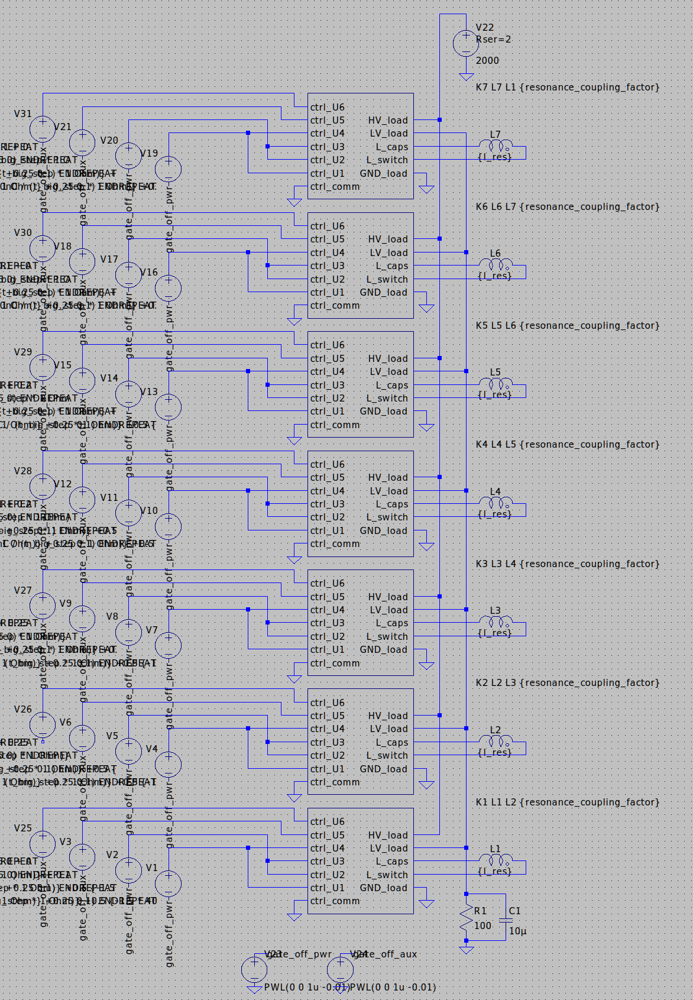
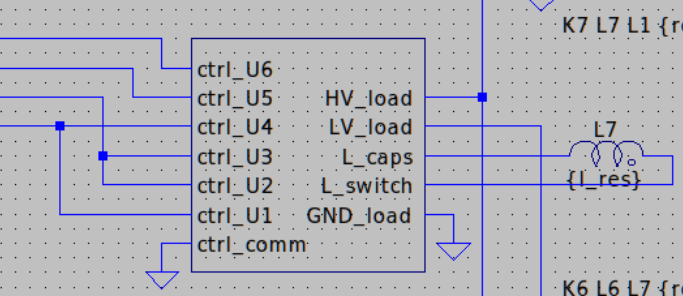
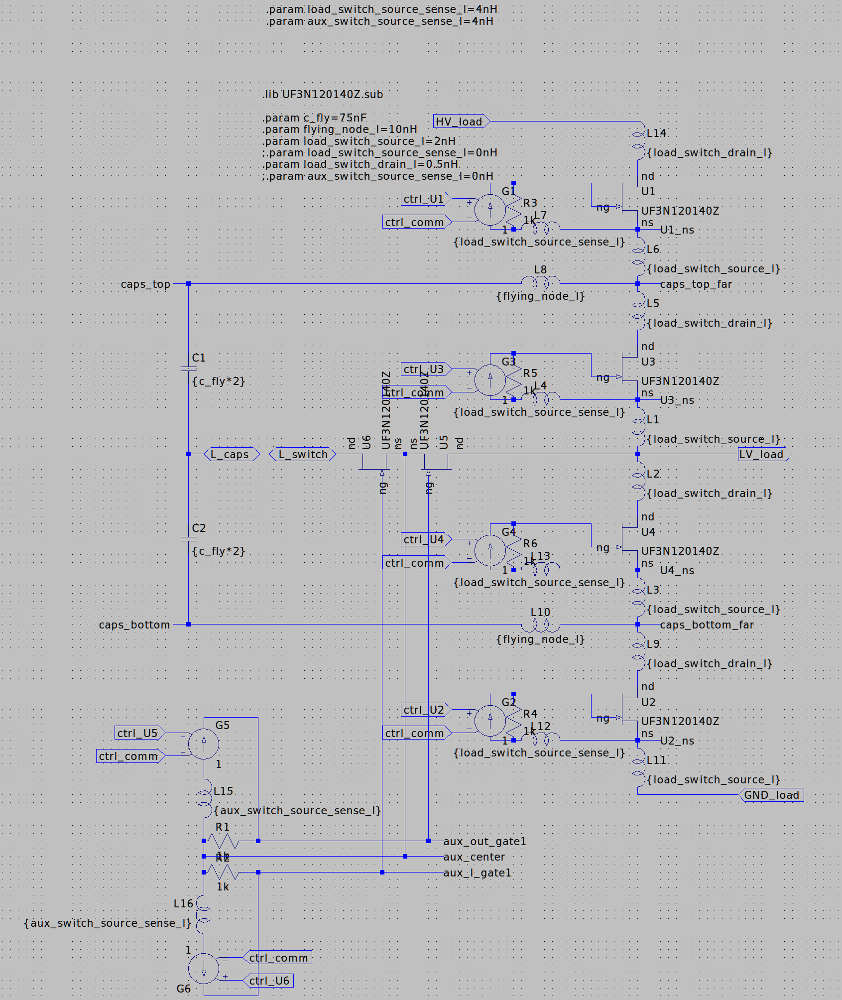
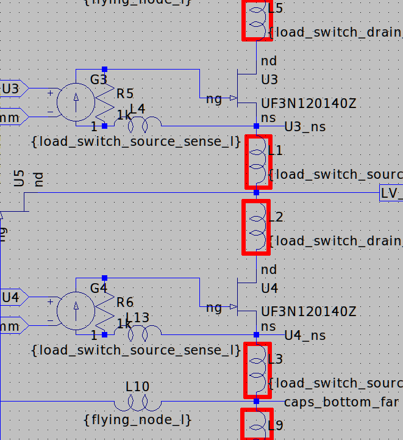
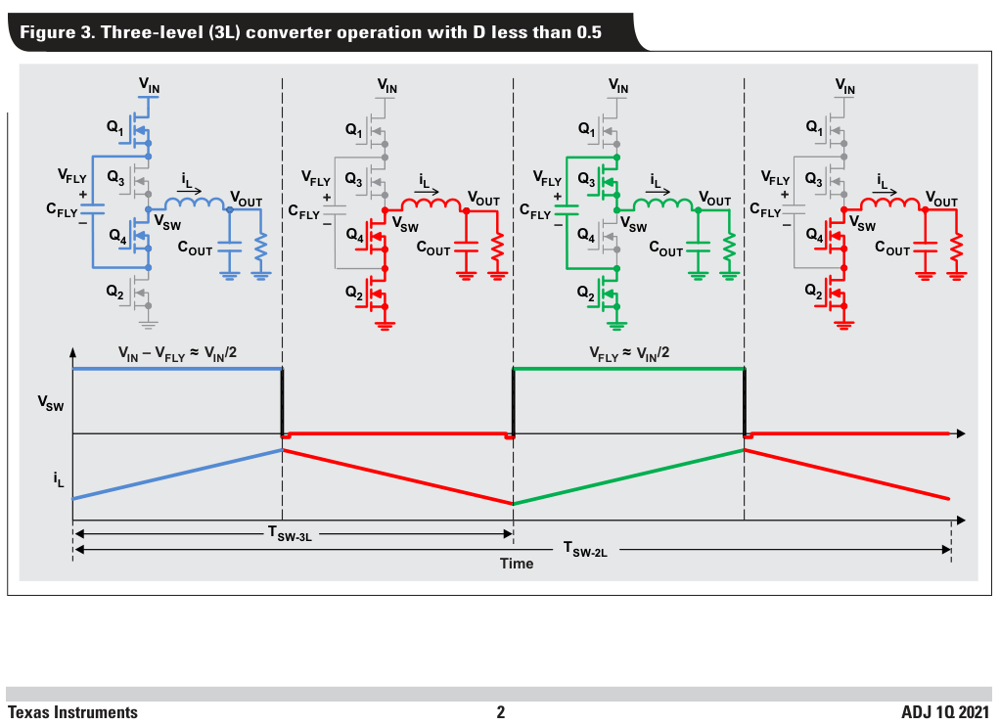

# MVDC tamer retrofit for electric train

Description of a project of a device that converts 1~10 kV DC down to Low
Voltage (LV) useable by electric train.

Context
--------------------------------------------------------------------------------

[Medium Voltage Direct Current (MVDC)][1] describes a way to transfer electric
power through direct current (DC), as opposed to alternative current (AC) power
lines.

It also opposes to [High Voltage DC (HVDC)][2] lines by using lower voltage
than the HVDC's 100 kV to 800 kV range, but is still significantly high voltage: 

The availability of new semiconductors allows railway to move from AC power
lines and Low Voltage DC (LVDC) [toward MVDC][3].

### High power

Even though the name "Medium" is there, it is still a considerable voltage
to approach for any parts.

Strategies like [cascodes][4] of multiple
power transistors, use of Silicon Carbide

Because it aims to power trains, it is also expecting to support high-current,
way above the rating of any single transistor.
voltage

### Small, cost efficient device

One goal is to allow reducing the costs of existing systems in the first place.

Allowing the device to be small is also helping with the ongoing transitions
of electric trains [from AC to MVDC]([3] by being installed at locations where
a much weaker AC to DC power converter was used.

Design
--------------------------------------------------------------------------------

The device is made of a central controller driving multiple modules. Each
module is made of a modified version of [a three-level buck-switching][5] circuit
from TI.

### Working of the modules together

Note: Each replicated module is represented as a block:

Each module have control signals driving the switching of the JFET power
transistors.

Using several modules has the following advantages:

- Increase the current rating of the device by splitting the current going
  through each module.

- With a phase offset between each module the output voltage ripple is averaged
  which allows a more stable output voltage without any output capacitors.

### Working of an individual module

Note: the inductors L1, L2, L3, L5, L9 are parasitics representing the wires
for simulation purposes, not part of the design.

Each of these modules would be converting the MVDC input down to LV.

Each follows the general principle from [TI's three-level buck-switching][5],
for which it splits the flying capacitor in two, and splits the output inductor
in two.

The transistor doing the big main PWM-style switching would be SiC JFETs.

This adds a resonant circuit between the flying capacitor and inductors,
allowing [Zero Voltage Switching (ZVS)][6] to increase efficiency: switching of
a JFET is only done when there is no voltage across it, which avoids "hard
switching": switching a JFET.

Every occurence of the world "auxiliary" refers to the addition of an auxiliary
switch to allow Zero Voltage Switching, as described in [Auxiliary Resonant
Commutated Pole (ACRP) converter][7].

TODO: extract what that means in our context, maybe with help of
<https://docs.lib.purdue.edu/cgi/viewcontent.cgi?article=1144&context=ecetr>

### Optical signal transmission

Due to the very large Electro-Magnetic Interferences (EMI) in such a
high-voltage context, optical transmission is being used.

The transceiver would be simple LEDs acting as both emitter (the way they are
most commonly used), and receivers (every LED is also a photodiode with poor
properties).

LEDs that are good enough at both would be selected.
Then the driver would send the data encoded as a 8b/10b signal.

This signal would let the peripheral device guess what the clock of the
controller device is: perform clock recovery to synchronize its own clock to
the controller device's clock. This permits to make sure every module's clock
phase and frequency is synchronized to the central controller's clock.

Control signals
--------------------------------------------------------------------------------

### Harmonics cancellation

TODO: where do the harmonics appear precisely?

Practical aspects
--------------------------------------------------------------------------------

Description of the challenges related to production.

### Use of Silicon Carbide (SiC)

The JFETs would be Silicon Carbide-based (SiC) [UF3N120140][8].

- 1200 V
- 14 A constant at 100°C
- 38 A at pulse at 20°C

A bare die would be fixated onto a lower-grade synthetic diamond (SiC)
substrate, 

### Cascoding the JFETs

In order to reach high-enough voltage, a [cascode][4] is built to divide the
MVDC into smaller voltages that JFETs can handle.

It would lead to a diagram similar to the one above, but with the resistors
replaced by NPN transistors to allow more driving strenght than what mere
resistors would allow.

### Assembly of the JFETs

Coupling multiple JFETs thermically allows them to be driven as if it was a
single bigger JFET, with a single gate driving the signal.

The source of one JFET needs to be connected to the drain of another JFET to chain them in a cascode.

[1]: https://www.siemens-energy.com/global/en/offerings/power-transmission/portfolio/medium-voltage-direct-current.html
[2]: https://en.wikipedia.org/wiki/High-voltage_direct_current
[3]: https://en.wikipedia.org/wiki/Railway_electrification#Medium-voltage_DC
[4]: https://en.wikipedia.org/wiki/Cascode
[5]: https://www.ti.com/lit/an/slyt807/slyt807.pdf
[6]: https://www.ti.com/lit/an/slua159/slua159.pdf
[7]: https://ieeexplore.ieee.org/document/152341
[8]: https://web.archive.org/web/20220721173332/https://unitedsic.com/datasheets/DS_UF3N120140.pdf
